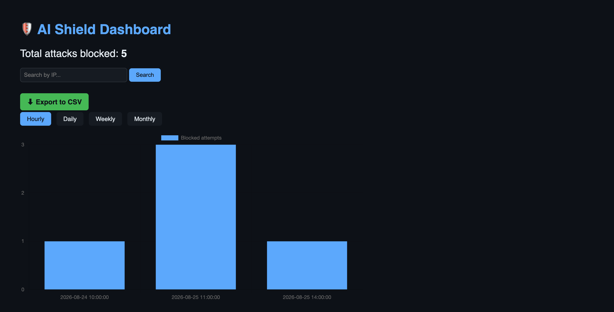
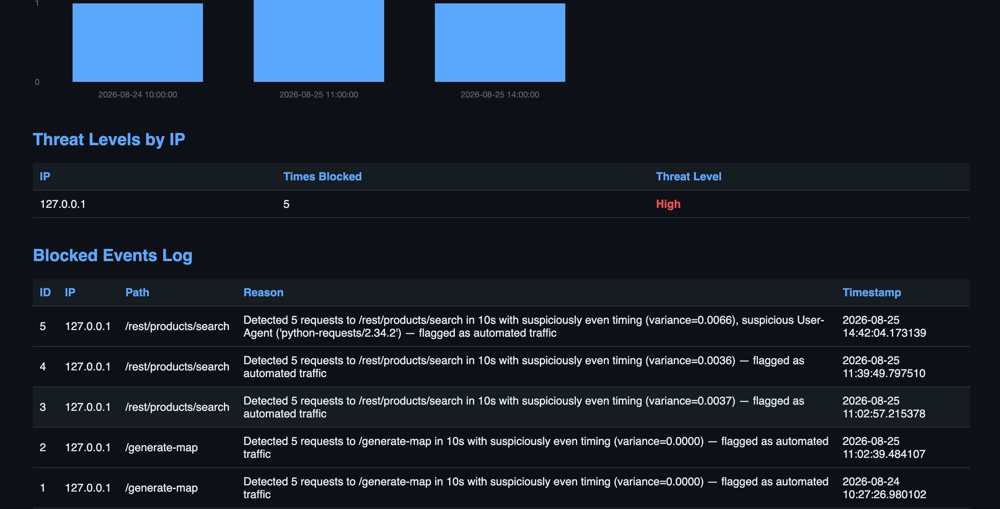
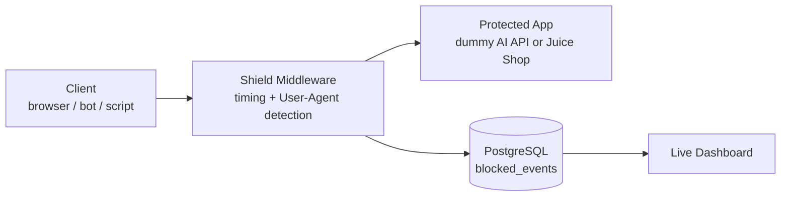

# 🛡️ AI Shield

A lightweight, self-hostable middleware that detects and blocks bot-like automated traffic hitting APIs — with a focus on protecting expensive AI-generation endpoints from abuse.

## The Problem

AI-generation APIs (image generation, map generation, text generation, etc.) are expensive to run — every request costs real compute resources. Unlike traditional endpoints, a single abused AI endpoint can rack up significant costs very quickly if hit by automated scripts. Most existing bot-protection tools (Cloudflare, DataDome, etc.) are enterprise-priced and built for general web traffic, not specifically for this emerging problem.

**AI Shield** is a small, understandable, self-hosted alternative: a middleware that any FastAPI (or similar) application can drop in to detect and block automated abuse, with full transparency into *why* each block happened.

## Features

- **Multi-signal bot detection**
  - Request timing analysis — flags suspiciously *even* intervals between requests (a signature of scripted traffic)
  - User-Agent analysis — flags requests from known scripting tools (`python-requests`, `curl`, `wget`, etc.) or missing User-Agent headers
- **Explainable blocking** — every block returns a human-readable reason, not just a generic error
- **Cooldown enforcement** — once flagged, an IP stays blocked for a configurable period, rather than being re-evaluated on every request
- **Per-endpoint tracking** — tracks IP + path combinations separately, so normal browser page-loads (which fire many simultaneous requests to different files) aren't mistaken for attacks
- **Persistent storage** — every blocked event is saved to PostgreSQL, surviving server restarts
- **Live dashboard**
  - Summary stats and a blocked-attempts chart (hourly / daily / weekly / monthly views)
  - Threat-level scoring per IP (Low / Medium / High, based on repeat offenses)
  - Search/filter by IP
  - CSV export of blocked events
  - Auto-refreshing (with smart pausing while actively searching)
- **Reverse-proxy architecture** — deployable in front of any existing application without modifying its code, tested against both a custom endpoint and [OWASP Juice Shop](https://owasp.org/www-project-juice-shop/)

## Screenshots

**Dashboard overview — live chart, time-range filters, export**


**Threat levels and detailed blocked-events log**


## Architecture

## Architecture



The shield is implemented as [Starlette/FastAPI middleware](shield/middleware.py), which means it can wrap **any** FastAPI application, or sit in front of an unrelated app (like Juice Shop) via a lightweight reverse proxy — without touching that app's own code.

## Tech Stack

- **Backend:** Python, FastAPI, Starlette middleware
- **Database:** PostgreSQL (via Docker), `psycopg2`
- **Proxying:** `httpx`
- **Dashboard:** Server-rendered HTML/CSS + Chart.js (via CDN)
- **Test target:** [OWASP Juice Shop](https://owasp.org/www-project-juice-shop/) (Docker)

## How It Works

1. A request arrives at a protected endpoint.
2. The shield checks: is this IP+path combination currently in a cooldown from a previous violation? If so, block immediately.
3. Otherwise, it logs the request timestamp and checks the last 10 seconds of activity for that IP+path:
   - If 5+ requests occurred with suspiciously **even timing** (low variance between gaps), OR
   - If the request's **User-Agent** matches a known scripting/bot signature,
   
   → the request is blocked, the IP enters a cooldown period, and the event is permanently logged to PostgreSQL with a human-readable explanation.
4. Legitimate traffic (irregular timing, real browser User-Agent) passes through untouched.

## Running Locally

### Prerequisites
- Python 3.11+
- Docker Desktop

### Setup

```bash
# Clone and set up environment
git clone https://github.com/LP-Ishadi/ai-shield.git
cd ai-shield
python3 -m venv venv
source venv/bin/activate
pip install -r requirements.txt

# Start PostgreSQL
docker run -d --name ai-shield-db -e POSTGRES_USER=postgres \
  -e POSTGRES_PASSWORD=shieldpass123 -e POSTGRES_DB=aishield \
  -p 5433:5432 postgres

# Initialize the database
python3 setup_db.py

# Run the demo AI-generation endpoint (protected)
uvicorn dummy_app:app --reload --port 8000

# (Optional) Run Juice Shop and its protected proxy
docker run -d -p 3000:3000 bkimminich/juice-shop
uvicorn proxy_app:app --reload --port 8001

# Run the dashboard
uvicorn dashboard_app:app --reload --port 8002
```

Visit `http://127.0.0.1:8002` for the dashboard.

### Simulating an attack
```bash
python3 attack_simulation.py             # targets the dummy AI endpoint
python3 attack_simulation_juiceshop.py   # targets Juice Shop via the proxy
```

## Known Limitations

- **WebSocket connections are not proxied** — the reverse proxy only handles standard HTTP request/response, so real-time features (like Juice Shop's live chat) will fail through the proxy. This is a known architectural gap for a first version.
- **In-process rate tracking** — request timing state (`request_log`, `blocked_until`) lives in memory, so it resets on restart, even though blocked *history* is persisted to the database. A production version would move this to Redis for both speed and persistence across restarts/multiple server instances.
- **Detection thresholds are hardcoded** rather than configurable via a config file (planned improvement).
- **No automated test suite yet** (planned improvement).

## Future Improvements

- Move rate-tracking state to Redis for persistence and multi-instance support
- Configurable detection thresholds via `.env` or config file
- Automated test suite (`pytest`)
- Package as an installable Python library (`pip install ai-shield`)
- WebSocket support in the reverse proxy
- IP reputation lookups and more advanced behavioral fingerprinting

## What I Learned

Building this project, I learned how middleware architecture works, how reverse proxies function, how to design and query a relational database, and how to debug real issues — including a port conflict between two PostgreSQL instances, a false-positive bug where legitimate browser traffic was being blocked, and a Python decorator ordering bug. 

---

*Built by [L.Praveena Ishadi] — https://github.com/LP-Ishadi*